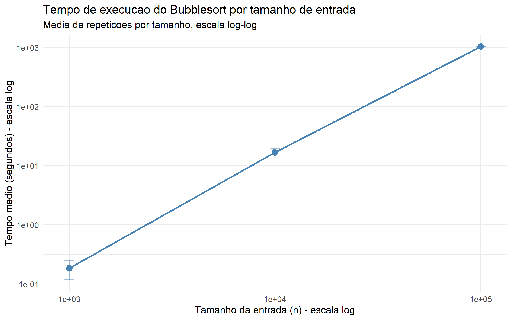

# atividade-bubble

Implementação do algoritmo Bubble Sort em R, com medição de desempenho para diferentes tamanhos de entrada, seguindo o pseudocódigo apresentado na página 32 do livro *Algoritmos: Teoria e Prática* (seção 2-2, Corretude do bubblesort).

## Integrantes

- Ana Carla
- Brunna Luyza

## Objetivo

Implementar o algoritmo Bubblesort, medir seu tempo de execução para entradas de diferentes tamanhos e demonstrar experimentalmente sua complexidade de tempo O(n²), comparando os resultados obtidos com a análise teórica.

## Pseudocódigo de referência

O algoritmo foi implementado seguindo fielmente o procedimento BUBBLESORT(A,n) do livro-texto:

BUBBLESORT(A,n)

1 for i = 1 to n - 1

2 for j = n downto i + 1

3 if A[j] < A[j-1]

4 trocar A[j] com A[j-1]

O laço interno percorre o vetor de trás para frente, "empurrando" os menores elementos em direção ao início a cada rodada, até que o vetor fique ordenado de forma crescente.

## Linguagem utilizada

R (versão 4.6.1)

## Estrutura do projeto

- `dados/` — arquivos de entrada fornecidos pelo professor (1000.txt, 10000.txt, 100000.txt, 1000000.txt), um número por linha
- `ler.R` — leitura dos arquivos de dados e conversão para vetor numérico
- `bubblesort.R` — implementação do algoritmo, seguindo o pseudocódigo da página 32
- `verificar.R` — confirma se o vetor resultante está corretamente ordenado
- `preparar.R` — garante que cada repetição de medição use uma cópia intacta do vetor original (evitando medir a ordenação de um vetor já ordenado)
- `escrever.R` — grava vetores/resultados em arquivo
- `simular.R` — script principal: executa o bubblesort múltiplas vezes para cada tamanho de entrada, mede o tempo com `system.time()`, agrega os resultados (média e desvio padrão) e gera o gráfico comparativo

## Metodologia

Para cada tamanho de entrada, o vetor original foi lido uma única vez e restaurado antes de cada repetição, garantindo que toda medição partisse do mesmo estado inicial desordenado. O tempo de execução foi medido isoladamente ao redor da chamada do `bubblesort()`, e a corretude da ordenação foi verificada após cada execução.

Número de repetições por tamanho:

| Tamanho (n) | Repetições |
|---|---|
| 1.000 | 30 |
| 10.000 | 10 |
| 100.000 | 1 |

O número de repetições foi reduzido para tamanhos maiores devido ao crescimento quadrático do tempo de execução, que tornaria repetições numerosas inviáveis dentro do prazo disponível.

## Resultados

| Tamanho (n) | Tempo médio (s) | Desvio padrão (s) |
|---|---|---|
| 1.000 | 0,184 | 0,067 |
| 10.000 | 16,897 | 2,895 |
| 100.000 | 1.045,020 | — (1 repetição) |

O gráfico abaixo (`grafico_bubblesort.png`) apresenta os tempos médios em escala log-log, onde a reta praticamente linear confirma visualmente o crescimento quadrático (O(n²)) do algoritmo.

## Sobre o caso de 1.000.000 de elementos

O arquivo `1000000.txt`, fornecido pelo professor, não foi executado até o fim. Com base na taxa de crescimento observada entre os tamanhos testados — o tempo aumentou aproximadamente 91x ao passar de 1.000 para 10.000 elementos, e cerca de 62x ao passar de 10.000 para 100.000, ambos próximos do fator 100x esperado teoricamente para um algoritmo O(n²) — estima-se que uma única execução com 1.000.000 de elementos levaria dezenas de horas, tornando-a inviável no prazo da atividade.

Essa limitação é, na prática, uma confirmação experimental da própria complexidade de pior caso do Bubblesort, O(n²): à medida que o tamanho da entrada cresce, o tempo de execução cresce proporcionalmente ao quadrado desse tamanho, tornando o algoritmo impraticável para entradas muito grandes — o que responde diretamente à questão (d) da página 32 do livro-texto.

Vale observar que, em linguagens compiladas como C++, C# e Java (escolhidas por outros grupos da turma), espera-se que a execução com 1.000.000 de elementos seja significativamente mais rápida, já que essas linguagens não dependem de interpretação em tempo de execução como o R.

## Como executar

No terminal, dentro da pasta do projeto, com o R instalado:

R.exe --no-save

source("simular.R")

Os resultados são salvos em `resultados_bubblesort_bruto.txt`, `resultados_bubblesort_resumo.txt` e `grafico_bubblesort.png`.
